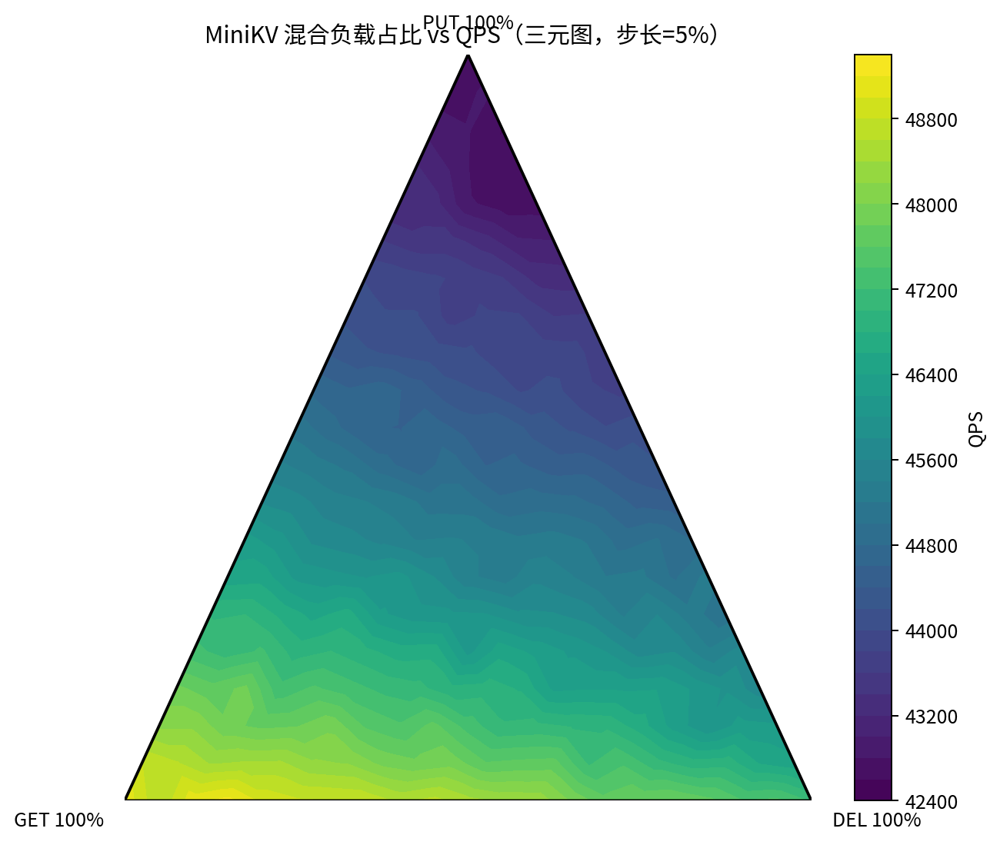

# MiniKV

MiniKV 是一个轻量级键值存储系统，采用 C++ 存储引擎 + Go HTTP 网关的分层架构，支持基础 KV 操作、WAL 持久化、Snapshot 恢复与并发压测。

## 技术栈

- C++17（存储引擎、并发控制、WAL/Snapshot）
- Go 1.22（HTTP API、TCP 转发、连接复用）
- TCP / HTTP（C++ 与 Go 分层通信）
- Thread Pool、shared_mutex、condition_variable（并发模型）
- WAL Batch Flush、Snapshot、Crash Recovery（持久化与恢复）
- Python + Matplotlib（三元图绘制与压测数据可视化）
- CMake、Linux（工程构建与运行环境）

## 项目结构

- cpp_engine：C++ 存储引擎（TCP 服务、WAL、Snapshot、线程池）
- go_server：Go HTTP 网关（REST API -> TCP 转发）
- benmark：压测与绘图脚本
- data：数据文件目录（data.db / wal.log）

## 核心能力

- 支持 PUT / GET / DELETE 全链路
- 启动恢复流程：加载 Snapshot，再重放 WAL
- 线程池并发处理请求
- WAL 批量刷盘能力（条数阈值 + 时间阈值）
- 混合负载压测（QPS、延迟、逻辑未命中、系统成功率）

## 技术架构

1. Go HTTP 层接收请求，校验参数后转为文本协议命令。
2. Go 通过 TCP 与 C++ 引擎通信，获取结果并返回给客户端。
3. C++ 引擎维护内存 KV，并将写操作写入 WAL 队列。
4. 后台线程按阈值批量刷盘，周期性 Snapshot 降低 WAL 长度。

## 快速开始

### 1) 构建 C++ 引擎

cd cpp_engine
mkdir -p build
cd build
cmake ..
make

### 2) 构建 Go 服务与压测工具

cd /item/MiniKV
go build -o go_server/minikv-go ./go_server
go build -o benmark/minikv-bench ./benmark

### 3) 启动服务

先启动 C++ 引擎：

cd /item/MiniKV/cpp_engine/build
./engine

再启动 Go API：

cd /item/MiniKV/go_server
./minikv-go

## API 示例

PUT：

curl -X POST http://127.0.0.1:8080/kv \
	-H "Content-Type: application/json" \
	-d '{"key":"name","value":"minikv"}'

GET：

curl "http://127.0.0.1:8080/kv?key=name"

DELETE：

curl -X DELETE "http://127.0.0.1:8080/kv?key=name"

## Benchmark 压测

运行混合负载压测：

cd /item/MiniKV
./benmark/minikv-bench -url http://127.0.0.1:8080/kv -workers 100 -requests 100000 -op mixed -keyspace 2000 -write-ratio 33 -delete-ratio 20

输出指标说明：

- QPS：每秒处理请求数（吞吐量）
- 平均延迟、P50/P95/P99：响应延迟分布
- 逻辑未命中：业务层 NOT_FOUND，不计为系统失败
- 失败请求 / 网络错误：系统层失败
- 系统成功率：排除逻辑未命中后的成功率

## 当前机器实测性能

测试机器配置：

- CPU：Intel(R) Xeon(R) CPU E3-1270 v3 @ 3.50GHz
- 逻辑核：8 vCPU（4 核 8 线程）
- 内存：15 GiB

典型压测命令：

cd /item/MiniKV
./benmark/minikv-bench -url http://127.0.0.1:8080/kv -url http://127.0.0.1:8080/kv -workers 40  -op mixed -requests 400000
典型结果（当前环境）：

- QPS：约 38,000+
- 平均延迟：约 884.7 µs
- P99 延迟：约 1.1ms - 1.3ms
- 系统成功率：约 99.9%

说明：压测结果会随请求比例、超时参数、后台进程状态而波动，建议固定参数并多次取中位值。

## 三元图绘制

默认只根据已有 CSV 绘图，不重新压测：

cd /item/MiniKV
python3 benmark/paint.py

如需重新采样并更新数据：

python3 benmark/paint.py --rerun

输出文件：

- benmark/out/mix_qps.csv
- benmark/out/mix_qps_ternary.png

压测三元图示例：

## 可调参数

WAL 相关环境变量：

- MINIKV_WAL_MODE：throughput 或 reliable
- MINIKV_WAL_BATCH_SIZE：批量刷盘阈值
- MINIKV_WAL_FLUSH_MS：刷盘时间阈值（毫秒）

Go RPC 连接池：

- MINIKV_RPC_POOL_SIZE：Go 到 C++ 的连接池大小
